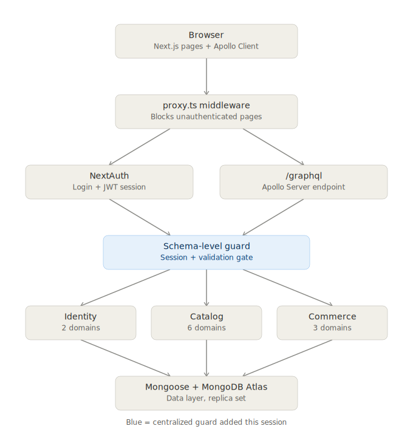
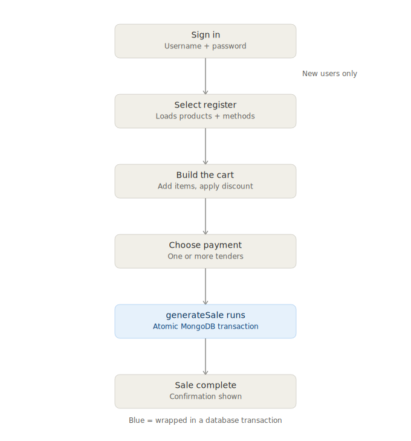

# System architecture & process flow

## Architecture

Every request flows through one centralized checkpoint (highlighted in blue) before it reaches business logic — this is what makes it impossible for a new resolver to accidentally skip authentication or input validation.

## Checkout process flow

The journey a cashier walks through, from sign-in to a completed sale.

Not shown on the flow chart, deliberately:

- **The customer credit/account-limit system.** `adjustAccountLimit`/`adjustStoreCredit` live entirely in the admin reports UI today, disconnected from `generateSale`. Once wired in, "Choose payment" gains a branch for "charge to account" / "use store credit," and the transaction step grows a fourth write debiting the customer's ledger alongside the payment/sale writes. See [resolvers.md](./resolvers.md#customer-resolverscustomerresolverts) for the current state of that system.
- **The dashboard** — currently a placeholder, nothing flows through it yet.

Both diagrams reflect the system as of the fixes described in [resolvers.md](./resolvers.md): the schema-level guard, the atomic sale transaction, and the forced-password-reset branch for new users.
